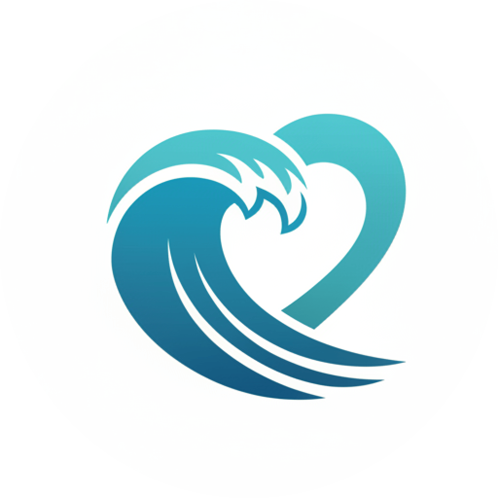

# 🌊 Aqua Chroma - 海蓝之心监控

<p align="center">
  
</p>

<p align="center">
  一个为 “海蓝之心” 项目打造的现代化、响应式实时监控仪表盘。
</p>

<p align="center">
  <a href="https://aqua-chroma-nuxt.netlify.app/"><strong> ✨ 在线预览 </strong></a>
</p>

<p align="center">
  
  
  
  
  <a href="https://app.netlify.com/sites/aqua-chroma-nuxt/deploys"></a>
</p>

Aqua Chroma 是一个基于 Nuxt 4 构建的前端应用，旨在通过直观的数据可视化界面，实时展示图像分析后的“海蓝程度”与“云层覆盖率”等关键指标。它提供了一个高效、美观的方式来追踪和分析环境数据。

## ✨ 核心功能

- **📈 动态趋势图**: 使用 ECharts 实现的交互式折线图，清晰展示海蓝程度的历史变化趋势，支持缩放和点击查看特定时间点详情。
- **📑 详细分析卡片**: 以卡片形式网格化展示每一次的分析结果，包含关键数据（海蓝程度、云层覆盖率）和处理前后的对比图像。
- **🛠️ 强大调试工具**: 内置调试功能，允许用户通过输入精确的时间戳，触发后端对特定数据进行重新分析，并在弹窗中展示详细的中间过程图像和数据。
- **📱 响应式与主题化**: 完美适配桌面和移动设备。内置亮色/暗色主题切换，并能自动同步 Arco Design 组件库的主题。
- **⚡️ 性能优化**: 采用无限滚动加载机制，优化了大量数据卡片的渲染性能，保证了流畅的用户体验。
- ** PWA 支持**: 支持渐进式 Web 应用，可“安装”到桌面或主屏幕，并提供离线访问能力。

## 🚀 技术栈

- **核心框架**: [Nuxt 4](https://nuxt.com/) (基于 [Vue 3](https://vuejs.org/))
- **开发语言**: [TypeScript](https://www.typescriptlang.org/)
- **样式方案**: [UnoCSS](https://github.com/unocss/unocss) - 即时按需的原子化 CSS 引擎。
- **UI 组件库**: [Arco Design Vue](https://arco.design/vue/docs/start)
- **状态管理**: [Pinia](https://pinia.vuejs.org/)
- **图表库**: [ECharts for Vue](https://github.com/ecomfe/vue-echarts)
- **工具库**: [VueUse](https://vueuse.org/), [Day.js](https://day.js.org/)
- **代码规范**: ESLint + Prettier

## 📦 快速开始

### 1. 环境准备

确保你的开发环境已安装 [Node.js](https://nodejs.org/) (推荐 v20 或更高版本) 和 [pnpm](https://pnpm.io/)。

### 2. 克隆项目

```bash
git clone https://github.com/your-username/aqua-chroma-nuxt.git
cd aqua-chroma-nuxt
```

### 3. 安装依赖

```bash
pnpm install
```

### 4. 配置环境变量

项目依赖一个后端 API 服务。请在项目根目录下创建一个 `.env` 文件，并配置 API 地址：

```env
# .env

# 后端服务的 URL
NUXT_PUBLIC_API_URL=https://aqua-chroma.sharee.top
```

在开发环境中，Nuxt 会自动将 `/api` 的请求代理到此地址。

### 5. 启动开发服务器

```bash
pnpm dev
```

现在，应用应该已经在 `http://localhost:3000` 上运行。

## 📜 可用脚本

- `pnpm dev`: 启动开发服务器，支持热模块重载。
- `pnpm build`: 为生产环境构建项目。
- `pnpm preview`: 在本地预览生产构建后的应用。
- `pnpm generate`: 将项目预渲染为静态站点。
- `pnpm lint`: 检查代码风格和潜在错误。
- `pnpm typecheck`: 对整个项目进行 TypeScript 类型检查。

## 部署

### Netlify

该项目已预先配置好通过 Netlify 进行一键部署。只需将你的 Git 仓库连接到 Netlify，它将自动根据 `netlify.toml` 文件进行构建和部署。

### Docker

项目也提供了 `Dockerfile`，你可以使用它来构建和运行一个独立的 Docker 容器。

```bash
# 1. 构建 Docker 镜像
docker build -t aqua-chroma-nuxt .

# 2. 运行容器
docker run -p 3000:3000 aqua-chroma-nuxt
```

应用将在容器内的 3000 端口上运行。
